# VEDA AI Product Requirements Document

## 1. What is VEDA AI? (Elevator pitch)

VEDA AI helps Indian students make one connected education decision instead of searching through dozens of disconnected websites. It brings university choices, scholarships, costs, loan pressure, and career outcomes into one personalized place, then explains the tradeoffs in clear language. The goal is simple: **Don't just find a university. Find the education path that makes sense for YOU.**

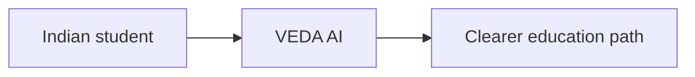

## 2. What is a hackathon?

A hackathon is a short, focused event where people turn an idea into a working product or demonstration. Judges usually look at whether the problem matters, whether the solution works, whether it is original, whether it could realistically grow, and whether the team can explain it clearly.

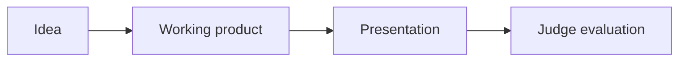

## 3. The Problem

For an Indian student planning higher education, the important information is scattered everywhere. University websites contain admissions and tuition details. Scholarship portals contain funding opportunities. Loan calculators show monthly payments. Career websites show possible outcomes. These sources rarely connect with one another.

That creates a difficult question: not simply, “Which university can I get into?” The real question is, “Which path fits my academic profile, budget, career goal, scholarship options, and ability to repay a loan?” Families may spend weeks comparing information manually, and they can still miss a better or safer option.

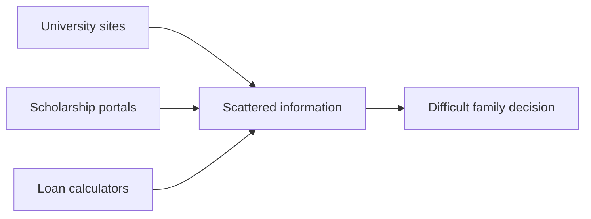

## 4. The Solution: What VEDA Actually Does

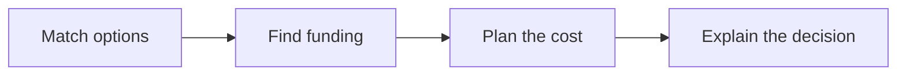

### University matching

A student enters information such as their field of study, academic performance, preferred countries, test scores, budget, and career goal. VEDA compares that profile with university information and ranks the strongest options. Each result includes an overall match score and separate academic, financial, and career fit scores. For example, a university might receive an 89% overall match, with academic fit at 100%, financial fit at 84%, and career fit at 82%.

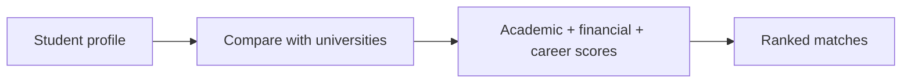

### Scholarship matching

VEDA compares the student’s home country, field of study, academic record, and income information with scholarship eligibility rules. It removes scholarships that clearly do not apply, then ranks the eligible options using eligibility, award value, and deadline urgency. A scholarship card can show the award amount, academic requirement, income eligibility, course fit, country, and when applications close.

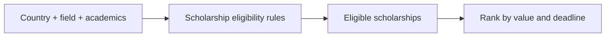

### Cost estimation

VEDA creates an illustrative estimate of the total education cost. It combines tuition with estimated living, travel, and insurance or other costs. Some of these costs are not present in the university dataset, so VEDA clearly labels them as assumptions rather than presenting them as official university figures.

For example, a plan might show ₹20 lakh of tuition plus estimated living, travel, and insurance costs for a total illustrative plan of ₹28 lakh. The exact result depends on the university, the selected profile, and the assumptions used.

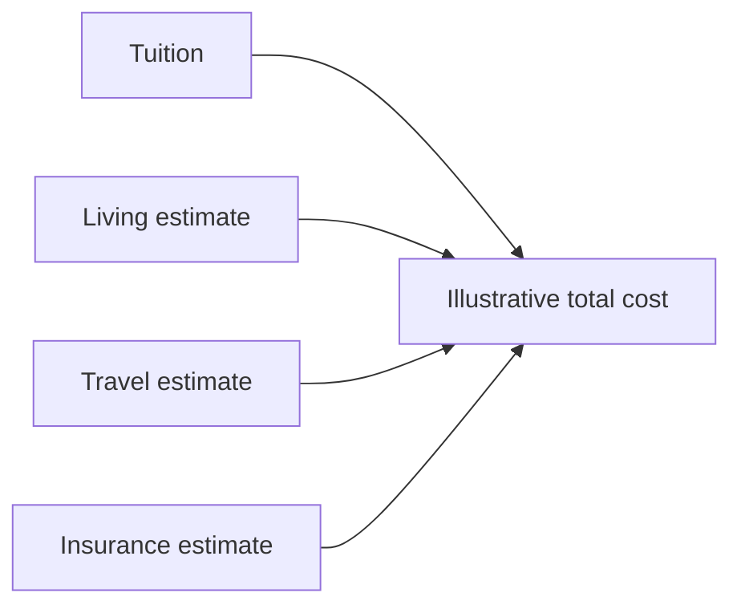

### Loan and EMI calculation

When savings and scholarships do not cover the estimated cost, VEDA calculates the remaining loan requirement. It then estimates the monthly EMI, or equated monthly installment, using a standard loan repayment formula. The current default assumptions are a 9% annual interest rate and a 7-year tenure, unless different values are supplied in a What-If scenario.

These are planning estimates, not loan offers. Actual interest rates, processing fees, repayment dates, and lender terms must be confirmed with a lender.

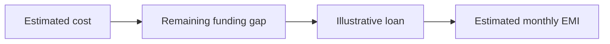

### Financial risk assessment

VEDA compares the estimated yearly EMI with the student’s expected annual salary. It labels the result LOW, MEDIUM, or HIGH using named thresholds. For example, if annual EMI is 18% of expected annual salary, the plan is treated as MEDIUM risk under the current rules.

The purpose is not to tell a family what they must do. It is to make repayment pressure visible early, before a student commits to an expensive path.

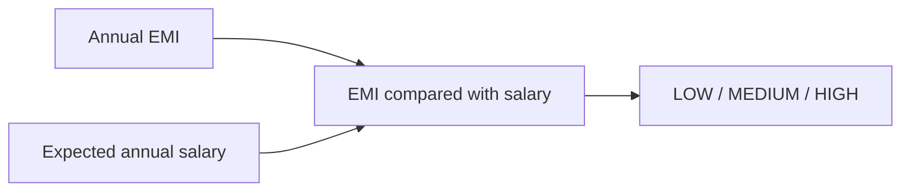

### Ask VEDA

Ask VEDA is the product’s decision assistant. A student can ask why a university was recommended, what a scholarship would change, or how a different loan amount affects the plan. The assistant receives the student’s actual profile, top university matches, top scholarship matches, and financial plan so it can explain the recommendation instead of giving generic advice.

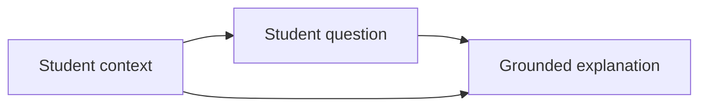

## 5. How It Is Built: System Overview

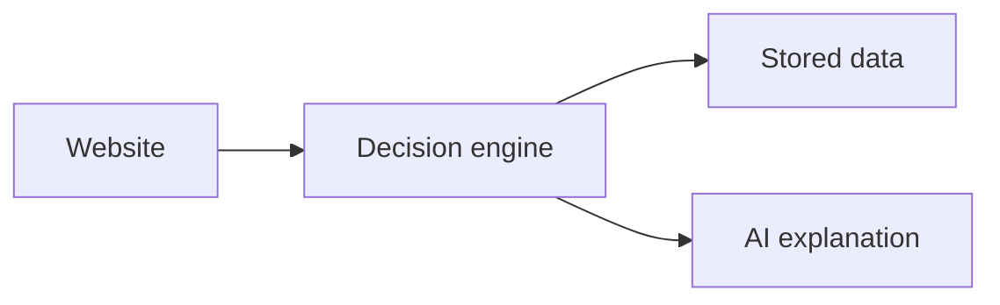

### 5a. High-level architecture

The product has three main parts. The website is what the student sees and clicks. The backend is the service that reads data, calculates matches, and prepares plans. The database stores profiles and education records. Clerk is the external login service, and Ollama Cloud is the external hosted AI service.

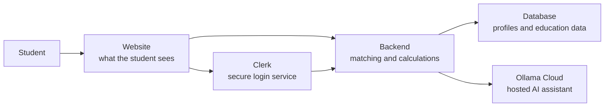

### 5b. User journey

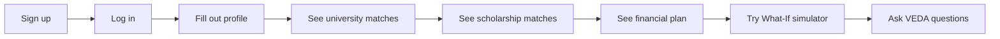

### 5c. Data flow example

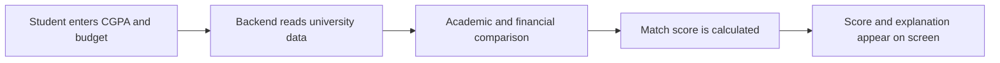

## 6. What Is in the Frontend?

The frontend is the visible website experience. Frontend means the part of a product that people see, read, and interact with.

| Screen | Purpose |
|---|---|
| Landing Page | Introduces VEDA AI and explains the education-decision problem. |
| Login and Signup | Lets a student create an account and return securely. |
| Onboarding | Collects academic, career, financial, and preference information. |
| Dashboard Overview | Gives the student a quick view of their education outlook, financial snapshot, next steps, and top university recommendation. |
| Universities | Shows ranked university matches with match scores, fit details, costs, and additional university information. |
| Scholarships | Shows eligible scholarship matches with award amounts, requirements, urgency, and official application links. |
| Financial Plan | Shows estimated total cost, funding sources, loan requirement, EMI, risk, payback period, and assumptions. |
| What-If Simulator | Lets the student change scholarship, loan, and expected salary values to see how the plan changes. |
| Ask VEDA | Provides a conversational way to ask questions about the student’s real recommendations and financial plan. |

The dashboard sections are connected to backend data rather than relying only on demonstration cards. Loading, empty, error, and retry states are included for the data-driven sections.

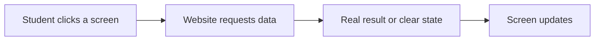

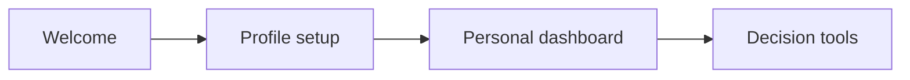

## 7. What Is in the Backend?

The backend is the behind-the-scenes part of the product. It receives requests from the website, reads stored information, applies matching and financial rules, and sends results back.

An API is a way for one part of a product, such as the website, to ask another part, such as the backend, for information or an action.

The backend is responsible for:

- Storing student profiles, including academic information, goals, countries, budgets, savings, expected salary, and loan preference.
- Storing university records, including location, admission statistics, costs, fields of study, outcomes, accreditation, and source information.
- Storing scholarship records, including award amounts, eligibility, deadlines, application links, and verification status.
- Calculating university match scores using academic, financial, and career fit.
- Calculating scholarship eligibility, award value, and deadline urgency.
- Building financial plans with cost, funding, loan, EMI, risk, and assumption information.
- Supporting What-If scenarios without changing the student’s saved profile.
- Preparing grounded context for Ask VEDA and sending it to a hosted AI model.
- Protecting personal dashboard actions behind secure login.
- Providing a health check so the running service can be tested quickly.

The backend uses MongoDB, a database that works like a large organized filing cabinet for structured information. It uses Express, a small web-service framework that helps the backend receive and answer requests. It uses Mongoose, a library that defines the shape of stored records and helps the application work with MongoDB.

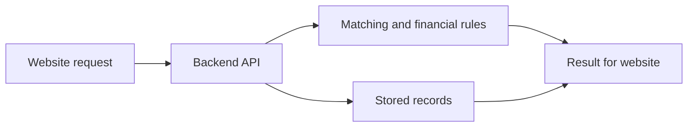

## 8. The Data

VEDA currently includes:

- **417 university records** across the USA, India, Canada, the UK, Australia, and Germany.
- **362 scholarship records** across the same six countries.
- **Six university data files and six scholarship data files**, one for each country.

The university data follows the supplied real-data format and includes source details such as provider, update date, status, and confidence. The project was prepared around published sources such as IPEDS and official university or education data.

The scholarship data includes official application links and source details such as provider type, source URL, last verified date, and current status. The product treats source information as important because education and funding decisions should be checked against official sources.

The data is loaded through repeatable seeding, meaning the records can be placed into the database from the JSON files and safely refreshed later. A stable external ID prevents the same record from being duplicated when the seed process is run again.

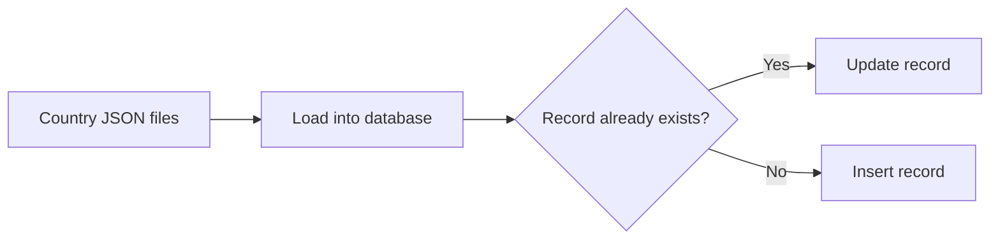

## 9. The AI Assistant: Ask VEDA

Ask VEDA is not intended to be a generic chatbot. Before answering, the backend assembles a structured context containing the student profile, the top university matches, the top scholarship matches, and the financial plan for the top university.

The assistant is instructed to reference only the universities, scholarships, and financial figures included in that context. If the answer is not in the context, it should say that it does not have the information instead of guessing.

Ask VEDA is powered by a cloud-hosted AI model through Ollama Cloud. The product uses a configurable model setting, with the current project default set to a hosted Gemma 4 cloud model that was tested successfully for grounded responses. The model can be changed through configuration without changing the product’s context-building logic.

Financial answers use the phrase “illustrative estimate” because living costs, travel, insurance, lender terms, scholarships, and future earnings can vary. Chat history is currently held in the student’s browser session and sent with each request; it is not stored in a separate chat database yet.

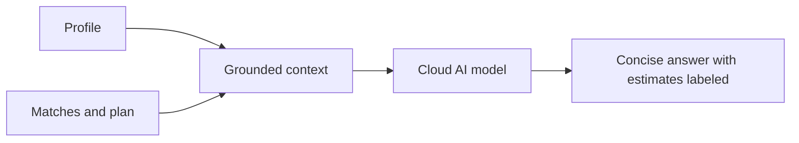

## 10. What Makes This Different and Why It Matters

Most education search tools help a student find universities. VEDA helps a student evaluate a connected path.

A high-ranked university may not be the best decision if the cost creates dangerous repayment pressure. A scholarship may look valuable but be unusable if the student’s nationality, course, or academic record does not qualify. A university with a slightly lower academic score may become the more sensible choice when its cost and career alignment are considered together.

VEDA makes these tradeoffs visible in one place. That matters for Indian students and families because studying abroad is a high-cost, high-stakes decision involving education, family savings, scholarships, loans, and future work. VEDA is designed to make that decision clearer without pretending that an estimate is a guarantee.

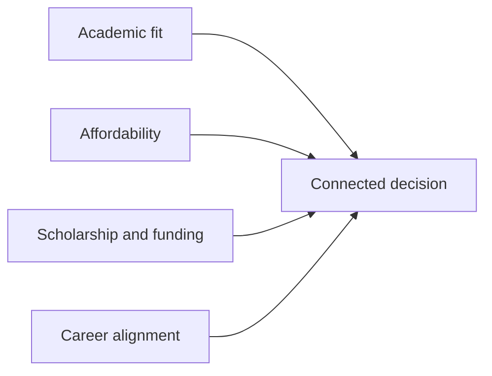

## 11. Current Status: What Is Built vs What Is Next

```mermaid
flowchart LR
    Built[Built today] --> Limits[Known limits]
    Limits --> Next[Next version]
```

### Built and working

- A working website with landing, authentication, onboarding, and dashboard navigation.
- Secure login integration through Clerk.
- Student profile storage with academic, career, country, budget, savings, expected salary, and loan-preference fields.
- A university data model matching the supplied university-centric records.
- A scholarship data model matching the supplied scholarship records, including nullable and structured income requirements.
- 417 university records and 362 scholarship records prepared in six-country datasets.
- Repeatable university and scholarship data loading with duplicate detection, insert/update counts, validation, and warnings for malformed records.
- Public university and scholarship browsing and detail services.
- Protected university and scholarship matching services.
- Rule-based university matching using academic, financial, and career fit.
- Rule-based scholarship matching using country, field, academic, income, amount, and deadline information.
- Financial-plan calculations for cost, savings, scholarships, loans, EMI, risk, payback period, and assumptions.
- A protected What-If service that accepts hypothetical financial changes.
- Dashboard Universities, Scholarships, Financial Plan, What-If, and Ask VEDA sections connected to real backend services.
- Loading, empty, error, and retry states in the data-driven dashboard sections.
- A grounded Ask VEDA backend connected to Ollama Cloud using a configurable hosted model.
- Successful direct testing of a cloud-model response that referenced the real top university, match score, fit scores, and an illustrative cost figure.

```mermaid
flowchart LR
    Profile[Profile] --> Matches[Matches]
    Matches --> Plan[Financial plan]
    Plan --> Simulator[What-If]
    Plan --> Copilot[Ask VEDA]
```

### Honest limitations today

- The matching rules are transparent, hand-designed rules; they are not machine learning and do not claim a measured accuracy percentage.
- Some financial inputs, including living, travel, and insurance costs, are estimates because they are not present in the university dataset.
- University program duration is assumed when a verified duration is not available.
- The current onboarding flow does not yet collect every field supported by the backend, including home country and expected salary. The backend handles missing values, but collecting them directly would improve matching and financial risk estimates.
- Chat history is not saved permanently; it lasts only in the current browser session.
- A live authenticated end-to-end chat test requires a real logged-in Clerk session and a correctly configured Ollama Cloud account.
- Scholarship and university information should still be checked on official sources before a student applies or borrows money.

```mermaid
flowchart LR
    Current[Working demo] --> Limits[Known assumptions and gaps]
    Limits --> Verify[Human and official-source verification]
    Limits --> Next[Future improvements]
```

### Strong next steps

- Add direct onboarding questions for home country, expected annual salary, and any missing profile details that improve eligibility decisions.
- Add saved university and scholarship selections so a student can carry one chosen plan across sessions.
- Add permanent, privacy-conscious chat history if users need to revisit prior conversations.
- Add more official data refresh automation and visible source freshness checks.
- Add formal automated tests for matching, financial calculations, API validation, and important edge cases.
- Add comparison tools for multiple university plans and scholarship combinations.
- Measure real user outcomes only after enough real usage exists; do not claim those results in the current demo.

```mermaid
flowchart LR
    BetterProfile[Collect richer profile] --> BetterMatches[Improve personalization]
    BetterMatches --> MoreTesting[Add tests and monitoring]
    MoreTesting --> PublicLaunch[Prepare for broader use]
```

## 12. Anticipated Judge Questions and How to Answer Them

```mermaid
flowchart LR
    JudgeQuestions[Judge questions] --> HonestAnswers[Clear honest answers]
    HonestAnswers --> Trust[Trust in the product]
```

### Technical and engineering judges

```mermaid
flowchart LR
    Judge[Technical judge] --> Explain[Explainable rules]
    Explain --> Evidence[Grounded data and honest limits]
```

**Question: How does the matching algorithm actually work?**

**Suggested answer:** “It is a transparent rule-based system. For universities, it compares academic information, financial fit, and career alignment, then combines those into an overall score. For scholarships, it first checks eligibility and then considers the award amount and deadline. We chose explainable rules first so a student can understand why a result appeared.”

**Do not claim:** Do not claim that the system is machine learning or that the scores have a proven accuracy percentage.

**Question: Why did you choose these technologies?**

**Suggested answer:** “We chose tools that let us build a real working product quickly while keeping the data structured. The website handles the student experience, the backend handles matching and calculations, MongoDB stores flexible education records, Clerk handles login, and Ollama Cloud provides the assistant. The important choice was separating the student experience, decision logic, stored data, and AI explanation.”

**Do not claim:** Do not claim that a technology choice alone guarantees scalability or correctness.

**Question: How do you keep the data accurate and updated?**

**Suggested answer:** “Each record carries source and verification information. University and scholarship records come from published or official sources, and the datasets can be safely reloaded when updated. We also show source information where available. The honest limitation is that a future production version would need scheduled refreshes and stronger monitoring.”

**Do not claim:** Do not claim that every record is permanently current or that the system automatically verifies every page today.

**Question: What happens if the AI makes something up?**

**Suggested answer:** “The assistant receives only the student profile and the matched records assembled by our backend. Its instructions say to use only those names and figures and to say when information is missing. That reduces the risk of unsupported answers, but it does not make an AI model infallible, so financial decisions still need official verification.”

**Do not claim:** Do not claim zero hallucinations or perfect reliability.

**Question: Is this scalable?**

**Suggested answer:** “The product is separated into a website, backend, database, login service, and AI service, so each part has a clear responsibility. The current demo is designed for a hackathon rather than a measured large-scale launch. At higher usage, we would add stronger monitoring, caching, background work, and capacity planning.”

**Do not claim:** Do not claim that the product has already been load-tested for thousands of users.

### Business and product judges

```mermaid
flowchart LR
    Need[Student decision burden] --> Product[Connected planning product]
    Product --> Value[Clearer choices]
```

**Question: Who is the target user, and how do you know they need this?**

**Suggested answer:** “Our first target user is an Indian student planning higher education, along with the family members who help fund that decision. They need to combine admissions, scholarships, costs, loans, and career outcomes, but those answers are usually spread across separate sources. VEDA is built around that specific decision burden.”

**Do not claim:** Do not invent survey results, user counts, or validated market percentages.

**Question: How is this different from existing university search websites?**

**Suggested answer:** “A search site usually helps someone discover or filter universities. VEDA connects discovery with affordability, scholarship eligibility, repayment pressure, and career fit. The product’s value is the connected path and the explanation of tradeoffs, not just a longer list of universities.”

**Do not claim:** Do not claim that competitors have no similar features unless you have verified that comparison.

**Question: What is your business model?**

**Suggested answer:** “The first goal is to prove that students find the connected decision useful. Possible future models include premium planning tools, partnerships with verified education services, or carefully designed financial guidance partnerships. We would need to protect student trust and avoid allowing sponsors to distort recommendations.”

**Do not claim:** Do not present an untested revenue forecast or say a lender will pay for referrals today.

**Question: How would you get your first 100 users?**

**Suggested answer:** “We would start with student communities, university clubs, education counselors, and families already comparing overseas study options. The first users would help us learn which assumptions and screens are most useful. We would measure repeated use and completed planning tasks before spending heavily on growth.”

**Do not claim:** Do not claim that these channels have already produced users unless they have.

### Design and UX judges

```mermaid
flowchart LR
    Complex[Complex decision] --> Clear[Clear screens and scores]
    Clear --> Confidence[More informed confidence]
```

**Question: Why this visual style?**

**Suggested answer:** “The visual language is designed to feel like a calm decision workspace rather than an advertising page. Students and families are comparing serious numbers, so the interface emphasizes hierarchy, clear scores, readable cards, and visible assumptions. The goal is confidence through clarity, not excitement through exaggerated promises.”

**Do not claim:** Do not say that the design has been validated by a large user study.

**Question: How did you think about a student with a very different profile?**

**Suggested answer:** “The product does not assume every student wants the same country, field, budget, or loan plan. The profile drives the comparisons, and missing data is treated as a data gap rather than automatically as a bad fit. The next design improvement is to collect more profile details directly so the system can serve more kinds of students well.”

**Do not claim:** Do not claim that every possible student profile has already been tested.

### Social impact and ethics judges

```mermaid
flowchart LR
    PersonalData[Student information] --> Protected[Secure access]
    Protected --> Responsible[Transparent recommendations]
```

**Question: How do you make sure the AI’s financial advice is not misleading?**

**Suggested answer:** “We call financial numbers illustrative estimates and show the assumptions used to create them. The assistant is instructed to use the supplied figures rather than inventing new ones. We also remind users to verify university, scholarship, lender, and outcome details from official sources.”

**Do not claim:** Do not call the product a financial advisor or guarantee loan affordability.

**Question: What about students who cannot afford any of the recommended options?**

**Suggested answer:** “That is exactly why financial fit is part of the recommendation instead of being hidden after admission. A high academic match can still have a poor financial fit. VEDA should make that visible and encourage students to compare lower-cost options, scholarships, and safer scenarios rather than pushing the most prestigious name.”

**Do not claim:** Do not promise that VEDA can find funding for every student.

**Question: How do you handle privacy for financial information?**

**Suggested answer:** “Dashboard access is protected by secure login, and the information is used to personalize the student’s own planning context. We do not need permanent chat storage for the current version. Before a larger launch, we would add a clear privacy policy, retention controls, stronger auditing, and a careful review of what is sent to external AI services.”

**Do not claim:** Do not claim that the current hackathon version has completed a formal privacy or security audit.

### Feasibility and skeptical judges

```mermaid
flowchart LR
    Demo[Working demo] --> Proof[Real data and tested flows]
    Proof --> NextScale[Measured future scaling]
```

**Question: Is this real data or made up for the demo?**

**Suggested answer:** “The project contains 417 university records and 362 scholarship records across six countries in structured datasets. University records include admission, cost, field, outcome, and source information; scholarship records include eligibility, amount, deadline, and official application information. The matching numbers are calculated from those records and the student profile, while some cost categories are clearly labeled estimates.”

**Do not claim:** Do not say that every number is a live official quote or that the system has complete coverage of every institution.

**Question: What would break if 1,000 people used this at once?**

**Suggested answer:** “The current version has not been load-tested at that level, so we would not pretend to know the exact limit. The areas to plan for are database capacity, repeated matching work, login-service limits, and AI-service capacity. We would address those with monitoring, caching, queued work, and scaling tests before a public launch.”

**Do not claim:** Do not claim that the current demo is proven for 1,000 simultaneous users.

**Question: What was the hardest technical problem you solved?**

**Suggested answer:** “The hardest problem was connecting data that normally lives in separate decisions. We had to keep university and scholarship records consistent, handle missing country-specific fields, make matching explainable, carry assumptions through financial calculations, and provide that context to the AI. The result is more than a chatbot because the AI is the final explanation layer over a structured decision system.”

**Do not claim:** Do not describe an unbuilt machine-learning pipeline or automated data validation system.

## 13. A Simple Glossary

- **AI model:** Software trained to recognize patterns and generate a response from an instruction.
- **API:** A controlled way for one part of a product to request information or an action from another part.
- **Authentication:** Checking that someone is really the account holder they claim to be.
- **Backend:** The behind-the-scenes part of a product that processes requests, applies rules, and returns results.
- **Cloud-hosted:** Running on computers operated by an online service rather than only on the user’s own computer.
- **Database:** An organized digital store for information, similar to a searchable filing cabinet.
- **Dashboard:** A screen that brings a user’s most important information and actions together.
- **Dataset:** A collection of structured records, such as universities or scholarships.
- **EMI:** Equated monthly installment, the estimated regular payment used to repay a loan.
- **Endpoint:** A specific online address where a service accepts a particular kind of request.
- **Express:** A tool used to organize and run web services in the backend.
- **Frontend:** The visible part of a product that a user sees and interacts with.
- **Heuristic:** A practical rule or estimate used when an exact answer is unavailable.
- **IPEDS:** A United States education data system that publishes information about higher-education institutions.
- **JSON:** A common text format for organizing data so different systems can read it.
- **LLM:** Large language model, an AI model trained to understand and generate human language.
- **Match score:** A number summarizing how well an option fits a student’s stated information.
- **Mongoose:** A tool that helps a backend define and work with records stored in MongoDB.
- **MongoDB:** The database technology used to store VEDA’s structured profiles and education records.
- **Ollama Cloud:** The online AI service used to host the model that powers Ask VEDA.
- **Prompt:** The instruction or question given to an AI model.
- **RAG-style grounding:** Giving an AI selected real records before it answers so the answer is tied to those records.
- **Rule-based:** Using explicit human-designed rules rather than a model that learns its own scoring logic.
- **Schema:** A description of what fields a stored record contains and what kind of information each field holds.
- **Seed or seeding:** Loading prepared data files into the database.
- **Session:** A period of use, such as the time a student stays in the website before closing or refreshing it.
- **TypeScript:** A version of JavaScript that adds checks to help prevent mistakes in website code.
- **What-If scenario:** A hypothetical change to inputs used to see how a result would change.

```mermaid
flowchart LR
    Term[Technical term] --> Meaning[Plain-English meaning]
    Meaning --> Confidence[Presenter confidence]
```

## 14. How to Run the Project

This section is for a local demonstration on a Windows computer. You do not need to understand the code to follow the sequence: install the tools, prepare private settings, load the data, start the two services, and open the website.

### Quick start commands

From the project root, install the website packages and start the website:

`pnpm install`

`pnpm dev`

The website opens at `http://localhost:3000`.

In a second terminal, move into the backend folder, install its packages, and start the backend:

`cd backend`

`npm install`

`npm run dev`

The backend normally runs at `http://localhost:5000`.

To load or refresh the real datasets, run these commands from the backend folder:

`npm run seed:universities`

`npm run seed:scholarships`

To confirm that the backend is running, open `http://localhost:5000/api/health`.

For a production-style website check, use:

`pnpm build`

`pnpm start`

```mermaid
flowchart LR
    Install[Install tools] --> Settings[Prepare private settings]
    Settings --> Seed[Load datasets]
    Seed --> Backend[Start backend]
    Backend --> Website[Start website]
    Website --> Demo[Open VEDA in browser]
```

### Before you start

Install Node.js, which runs the project’s website and backend; pnpm, which installs the website packages; MongoDB access, which stores profiles and education records; and a modern browser. For the AI assistant, create an Ollama Cloud API key and make sure the configured hosted model is available on your Ollama plan.

```mermaid
flowchart LR
    Node[Node.js] --> Ready[Local computer ready]
    Pnpm[pnpm] --> Ready
    Mongo[MongoDB access] --> Ready
    Ollama[Ollama Cloud access] --> Ready
```

### Prepare private settings

Inside the backend folder, make a private settings file based on the example settings file. Add the MongoDB connection value, Clerk login values, the website origin, and the Ollama Cloud API key. Keep this private file out of version control and never paste its contents into a presentation or chat.

For Cloud AI, use the Ollama website as the service address and set the configured model to the confirmed working cloud model, or to another model your plan supports. The example settings file contains placeholders only.

```mermaid
flowchart LR
    Example[Example settings] --> Private[Private local settings]
    Private --> BackendConfig[Backend configuration]
    BackendConfig --> Services[Database + login + AI services]
```

### Install packages

From the project root, run `pnpm install` to install website packages. Then move into the backend folder and run `npm install` to install backend packages.

```mermaid
flowchart LR
    Root[Project root] --> WebsitePackages[Website packages]
    BackendFolder[Backend folder] --> BackendPackages[Backend packages]
```

### Load the real datasets

From the backend folder, run `npm run seed:universities` to load the university records and `npm run seed:scholarships` to load the scholarship records. The commands safely update existing records and report inserted, updated, and skipped records.

```mermaid
flowchart LR
    UniversityFiles[University files] --> UniversitySeed[University seed]
    ScholarshipFiles[Scholarship files] --> ScholarshipSeed[Scholarship seed]
    UniversitySeed --> Database[MongoDB]
    ScholarshipSeed --> Database
```

### Start the backend

From the backend folder, run `npm run dev` for the development server. The backend normally listens on port 5000. A quick check is the health address `http://localhost:5000/api/health`; a healthy response confirms that the backend is running.

```mermaid
flowchart LR
    Command[Start backend] --> Port[Port 5000]
    Port --> Health[Health check]
    Health --> Ready[Backend ready]
```

### Start the website

Open a second terminal at the project root and run `pnpm dev`. The website normally opens at `http://localhost:3000`. Visit that address in a browser, create or use a Clerk account, complete onboarding, and then open the dashboard.

```mermaid
flowchart LR
    Command[Start website] --> Browser[Open localhost:3000]
    Browser --> Login[Log in]
    Login --> Dashboard[Open dashboard]
```

```mermaid
sequenceDiagram
    participant Person as Presenter
    participant Website as Website
    participant Backend as Backend
    participant Data as MongoDB
    Person->>Website: Open localhost:3000
    Website->>Backend: Request profile and matches
    Backend->>Data: Read saved records
    Data-->>Backend: Return data
    Backend-->>Website: Return recommendations
    Website-->>Person: Show dashboard
```

### Demonstrate the main flow

Sign up or log in, complete the profile, open Universities to show ranked options, open Scholarships to show eligibility and deadlines, open Financial Plan to show cost and funding, use What-If to change the loan or scholarship amount, and open Ask VEDA to ask why the top university was recommended.

```mermaid
flowchart LR
    Profile[Complete profile] --> Universities[Show matches]
    Universities --> Scholarships[Show funding]
    Scholarships --> Plan[Show plan]
    Plan --> Simulator[Change a scenario]
    Simulator --> Ask[Ask VEDA]
```

### Common setup checks

If the website cannot reach the backend, confirm that both development servers are running and that the website’s backend address points to port 5000. If protected screens return an authentication message, sign in again. If Ask VEDA reports that the assistant is unavailable, verify the Ollama Cloud model and API key settings without printing the key. If the database connection fails, check the MongoDB network access and private connection setting.

```mermaid
flowchart TD
    Problem[Something does not load] --> WebsiteCheck{Website running?}
    WebsiteCheck -->|No| StartWebsite[Start website]
    WebsiteCheck -->|Yes| BackendCheck{Backend healthy?}
    BackendCheck -->|No| StartBackend[Start backend]
    BackendCheck -->|Yes| SettingsCheck[Check private settings]
    SettingsCheck --> ServiceCheck[Check database, login, or AI service]
```
